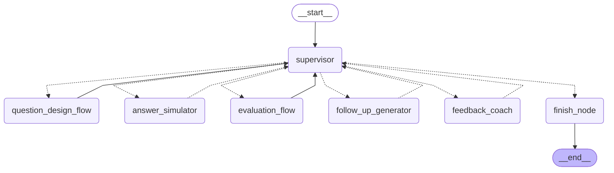

# 面试模拟系统 — LangGraph 状态图

```mermaid
---
config:
  flowchart:
    curve: linear
---
graph TD;
	__start__([__start__]):::first
	supervisor(supervisor)
	question_design_flow(question_design_flow)
	answer_simulator(answer_simulator)
	evaluation_flow(evaluation_flow)
	follow_up_generator(follow_up_generator)
	feedback_coach(feedback_coach)
	finish_node(finish_node)
	__end__([__end__]):::last
	__start__ --> supervisor;
	answer_simulator -.-> supervisor;
	evaluation_flow --> supervisor;
	feedback_coach -.-> supervisor;
	follow_up_generator -.-> supervisor;
	question_design_flow --> supervisor;
	supervisor -.-> answer_simulator;
	supervisor -.-> evaluation_flow;
	supervisor -.-> feedback_coach;
	supervisor -.-> finish_node;
	supervisor -.-> follow_up_generator;
	supervisor -.-> question_design_flow;
	finish_node --> __end__;
	classDef default fill:#f2f0ff,line-height:1.2
	classDef first fill-opacity:0
	classDef last fill:#bfb6fc
```
